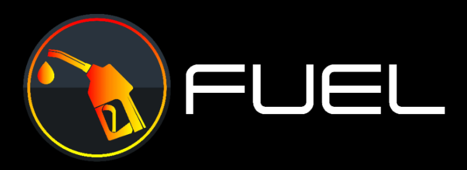

# BUY GAS WITH CRYPTO AND SAVE!

## FUEL REWARDS
Get Crypto & Cash Points Back at the Pump

### Token Address
0x689500593721f3202Ee994d11007741959fad183

## About Us
In the year 2022, skyrocketing fuel prices have threatened livelihoods and social stability and is crippling the worldwide economy .
Fuel Token provides a global payment system to be accepted at gas stations all around the world.

Merchants can enable FUEL Token acceptance anywhere they currently receive payments, whether in-store, online, or in their FUEL mobile app. Fuel holders gain incredible crypto and points for cash rewards to offset the rising costs of gasoline. 
[WHITEPAPER](https://fueltoken.net/wp-content/uploads/2022/07/FUEL-TOKEN-Whitepaper.pdf)

## Rewards
#### Points = Cash Back
Promotions offered by all major gasoline companies partnered with Fuel Token as an affiliate marketing company.

#### Crypto Back
Reflections from all worldwide transactions paid to holders in Fuel Tokens.

## Mission

Fuel Token will be used as a global payment system to be
accepted at gas stations all around the world.
Fuel’s technology will allow instant digital payments at gas pumps everywhere through our mobile app.
Our plan is for Fuel Token to be transacted at a lower rate than any merchant credit or debit card purchases. This makes our token much more attractive to owners of gasoline companies by increasing their overall net profits.

Fuel will be a Universal Token available and traded throughout all major crypto networks.

Initially started on the Binance Smart Chain (BNB) through PancakeSwap, FUEL will become a true universally traded token with limited supply spread out over more networks than any other token in the world such as ETH, Polygon/Matic, Ripple/XRP, Hyperledger, Tezos, Steller, Corda & so many more with seamless cross chain conversions with our future developed platform.

## Tokenomics
|Token Name:| FUEL|
|-|-|
|Total Supply: |100,000,000|
|1st Network:| Binance Smartchain/BSC|
|Specification: |Bep20|

### Taxes
|||
|-|-|
|Reflections:| 3%|
|Liquidity:| 3%|
|Marketing: |2%|
|Buy Back:| 1%|

## Roadmap
- ### Q4 2022
    - 5,000,000 social media reach
    - 1,000,000 Holders
    - KuCoin Listing
    - Binance Listing
    - 10 additional exchange listings
    - Partnerships with several leading gas companies
- ### Q3 2022
    - Token deployment
    - Socials
    - Website
    - Pre-Sale
    - Public Launch on PancakeSwap
    - Coin Gecko Listing
    - Coin Market Cap Listing
    - 100,000 Holders
    - Massive marketing
    - CEX Listing
- ### Q2 2023
    - 25,000,000 social media reach
    - 10,000,000 Holders
    - Global recognition
    - Become the leading form of gasoline payments using all major blockchain networks
- ### Q1 2023
    - 15,000,000 social media reach
    - 5,000,000 Holders
    - Mobile App
    - Listing on all major exchanges
    - Easy purchase with all global currencies
    - Partnerships with ALL leading gasoline companies
    - Initial development of cross chain network technology
    -Implementation of digital gas stat

## Contact
[Twitter](https://twitter.com/FuelToken_) 
[Telegram](https://twitter.com/FuelToken_) 
[Github](https://github.com/FuelToken) 
[Pinterest](https://www.pinterest.com/FuelToken) 
[Instagram](https://www.instagram.com/fueltoken_/) 
[Facebook](https://www.facebook.com/FuelToken) 
[Reddit](https://www.facebook.com/FuelToken) 
[Discord](https://discord.gg/mhKCBYcP) 
